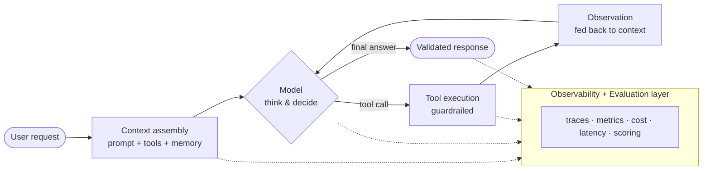
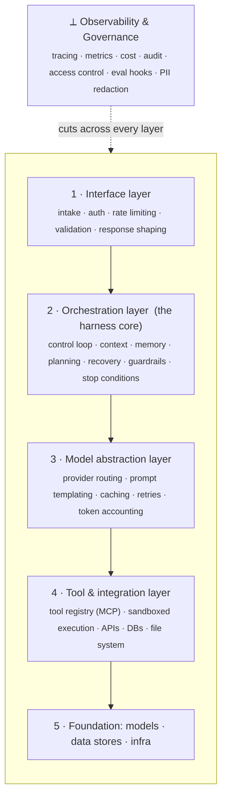
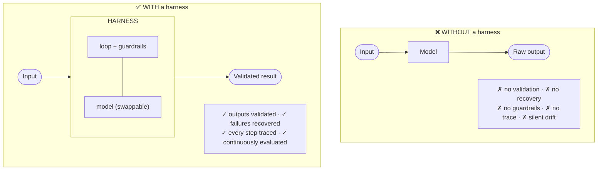

# AI Harnesses — The Complete Guide 🦾

> The scaffolding that turns an AI **model** into a reliable **system**.

A comprehensive, engineering-focused reference on **AI harnesses**: what they are, how they work, how they're architected, and why scaffolding + evaluation are now essential infrastructure for reliable, observable, production-ready AI.


---

## 📌 TL;DR

- An **AI harness** is the engineering layer wrapped around a model that manages how it's invoked, what it can do, how its outputs are validated, and how its behavior is measured.
- Two related flavors: an **agent harness** (runtime loop + tools + guardrails so a model can *act*) and an **evaluation harness** (framework that *tests & measures* a model against benchmarks).
- Community shorthand: **`Agent = Model + Harness`** — *"the model is the engine, the harness is the car."*
- As frontier models converge, the **harness is the differentiator** — scaffolding changes alone have produced **10–20 point swings** on SWE-bench with the *same* model.

---

## 📖 Table of Contents

1. [Introduction to AI Harnesses](#1-introduction-to-ai-harnesses)
2. [How an AI Harness Works](#2-how-an-ai-harness-works)
3. [AI Harness Architecture](#3-ai-harness-architecture)
4. [Importance of AI Harnesses](#4-importance-of-ai-harnesses)
5. [Real-World Examples](#5-real-world-examples)
6. [Harness vs No Harness](#6-harness-vs-no-harness)
7. [Benefits of Using a Harness](#7-benefits-of-using-a-harness)
8. [Comparison: With vs Without](#8-comparison-with-harness-vs-without-harness)
9. [Best Practices](#9-best-practices)
10. [The Future of AI Harnesses](#10-the-future-of-ai-harnesses)
11. [Worked Example: Build a Harness in 5 Passes](#-worked-example-build-a-harness-in-5-passes)
12. [FAQ](#-faq)

---

## 1. Introduction to AI Harnesses

For years, the AI story was about **models** — bigger, better, new benchmarks. But anyone who has shipped AI to real users knows the uncomfortable truth: **the model is only a fraction of the work.** The decisive engineering lives in everything *around* the model — and that layer has a name: the **AI harness**.

> [!NOTE]
> **AI harness (noun):** the engineering layer wrapped around one or more AI models that manages how the model is invoked, what it can do, how its outputs are validated, and how its behavior is measured — prompt construction, tool access, context/memory, the control loop, error handling, guardrails, evaluation, and observability. Everything the model does **not** do natively.

### Two engineering traditions

| Tradition | Meaning | Maps to |
|---|---|---|
| **Test harness** (classic SW eng) | The rig that feeds a program inputs, captures outputs, reports pass/fail | **Evaluation harness** |
| **Physical harness** (straps that direct power safely) | Channels a powerful, unpredictable force toward a safe, useful outcome | **Agent harness** |

A bare model is an inert function: *text in, text out* — no memory, no actions, no notion of correctness. Everything that turns it into a working product, and everything that tells you whether it's good, is **harness**.

### Why harnesses are now essential

- **Models converged** → the surrounding system became the differentiator.
- **AI moved from suggestions to actions** → unconstrained actions are a liability.
- **Non-determinism made testing non-optional** → the same prompt can drift or degrade.
- **Enterprises demanded governance** → audit trails, access control, reproducibility.

| Stat | Value |
|---|---|
| Harness impact on output quality vs. raw model | **~2×** |
| SWE-bench Verified gains from scaffolding alone | **10–20 pts** |
| AI benchmarks tracked by Stanford HAI (2017 → 2023) | **59 → 360+** |

---

## 2. How an AI Harness Works

A large language model is a **stateless function**. Every capability beyond "predict the next token" is supplied by the harness.

### Core functionality

- **Prompt & context construction** — assembles the system prompt, tool schemas, memory, retrieval, and the request.
- **Tool exposure & execution** — the model expresses intent; the harness performs the action.
- **The control loop** — decides when to call the model, when to call a tool, when to loop, **when to stop**.
- **Memory & state** — persists history and intermediate results; compacts context.
- **Error handling & recovery** — retries, fallbacks, reformulation.
- **Guardrails & safety** — constrains tools, data, and actions; enforces approvals.
- **Evaluation & scoring** — runs inputs, captures outputs, computes metrics.
- **Observability** — traces prompts, responses, tool calls, latency, cost, errors.

> [!IMPORTANT]
> A model decides **what it wants to do**. A harness decides **what actually happens**. Every consequential action passes through the harness — which is exactly why reliability, safety, and measurability are won or lost there.

### Execution flow (the ReAct loop)



1. **Intake** → normalize, attach permissions, start a trace.
2. **Context assembly** → system prompt, tool schemas, memory, retrieval.
3. **Model invocation** → final answer *or* structured tool-call intent.
4. **Decision** → act or terminate.
5. **Tool execution** → validate against guardrails, run, capture result.
6. **Observation** → feed result back into context.
7. **Loop or terminate** → until done, or a bound/guardrail fires.
8. **Finalize** → validate, return, close the trace (cost, latency, steps).

For an **evaluation harness**, the same shape runs over a *dataset*: iterate inputs → run model/agent → score against references or an LLM-as-judge → emit a reproducible report.

### Integration with models, tools, and systems

- **Models** — abstract behind an interface; route across providers; send easy subtasks to small models, hard reasoning to frontier models.
- **Tools** — code interpreters, search, databases, file systems, internal APIs; increasingly standardized via **MCP (Model Context Protocol)**.
- **Systems** — auth, logging/monitoring, CI/CD, feature flags, secrets, data stores.

```python
# The canonical control loop at the heart of an agent harness
def run_harness(request, model, tools, guardrails, tracer, max_steps=12):
    context = assemble_context(request, tools)      # prompt + schemas + memory
    for step in range(max_steps):
        tracer.start(step)
        output = model.generate(context)            # the model decides

        if output.is_final:
            result = validate(output.answer, guardrails)
            tracer.finish(result)
            return result                           # <-- terminate

        call = output.tool_call
        if not guardrails.permit(call):             # safety enforced here
            observation = "DENIED: action not permitted"
        else:
            try:
                observation = tools.execute(call)
            except ToolError as e:
                observation = recover(e)            # retry / fallback

        context = append(context, call, observation)  # feed result back
        context = compact_if_needed(context)           # manage the window

    return stop_with_reason("max_steps_exceeded")      # bounded, never runaway
```

This tiny loop already guarantees what a bare call never does: the run is **bounded**, every action is **permission-checked**, failures are **recovered**, and every step is **traced**.

---

## 3. AI Harness Architecture

A production harness is a **layered architecture**. Clean separation of concerns is what lets it scale, be tested, and evolve.



| Layer | Responsibility |
|---|---|
| **1 · Interface** | Request intake, auth/authz, rate limiting, input validation, response shaping. For eval harnesses: the test runner + config. |
| **2 · Orchestration (core)** | Control loop, context assembly, memory, planning, recovery, guardrails, stop logic, multi-agent coordination. **This is "the harness."** |
| **3 · Model abstraction** | Provider routing, prompt templating, caching, retries/backoff, token accounting. Makes the model swappable. |
| **4 · Tools & integration** | Tool registry + schemas, sandboxed execution, APIs/DBs/filesystem. MCP lives here. |
| **5 · Foundation** | The models, vector/relational stores, compute, and infra the harness drives. |

> [!NOTE]
> **Observability & governance is a cross-cutting concern, not a layer you pass through once.** Tracing, metrics, cost, audit trails, access control, eval hooks, and PII redaction must observe and constrain behavior at *every* level. You cannot retrofit traces you never captured.

### Monitoring & evaluation mechanisms

- **Tracing** — structured, replayable, end-to-end run trees (the most valuable debug artifact).
- **Metrics & cost telemetry** — latency, tokens, $/task, step counts, success rates.
- **Offline evaluation** — curated datasets/benchmarks as CI quality gates.
- **Online evaluation** — sample live traffic, score continuously, catch drift.
- **Regression detection** — compare against historical baselines automatically.

### Scalability & reliability

| Concern | Practice |
|---|---|
| Concurrency | Stateless core; per-request state in the trace/session store |
| Backpressure | Queue, throttle, degrade gracefully under provider quotas |
| Caching | Cache repeated model/tool calls → cut cost + latency |
| Resilience | Timeouts + circuit breakers on every external call |
| Bounded execution | Hard caps on steps, tokens, wall-clock, and spend |
| Recovery | Idempotent side effects; safe resume/rollback |

> [!TIP]
> **Architecture rule of thumb:** make the **model the only non-deterministic, swappable component** and keep everything around it deterministic, observable, and bounded.

---

## 4. Importance of AI Harnesses

### For development teams
A stable substrate (loop, tools, memory, eval) written once and reused → engineers focus on behavior, not plumbing. The system becomes **legible** (traces show exactly what failed) and **safe to change** (swap a model, tweak a prompt → run the eval suite).

### Quality assurance & testing
You can't rely on binary pass/fail tests for non-deterministic systems. An eval harness lets you define "good" measurably (accuracy, format, grounding, safety, latency), run **regression tests**, and do **comparative evaluation** with data instead of vibes.

> [!WARNING]
> In traditional software a passing test stays passing. In AI systems, a passing case can **start failing on its own** when the provider updates the model, prompts interact unexpectedly, or inputs shift. Continuous evaluation is a monitoring requirement, not a one-time gate.

### Performance optimization
Visibility into every call enables: model routing (cheap models for easy subtasks), caching, parallel tool calls, context compaction, and pruning wasteful steps — gains that have nothing to do with the model.

### Security & governance
The harness is the **chokepoint** where policy is enforced: least-privilege access, human-in-the-loop gating, full audit trails, data protection/PII redaction, and prompt-injection defenses. For regulated industries these are preconditions to deploy at all.

---

## 5. Real-World Examples

### 🤖 AI agent testing & coding agents
**SWE-bench** evaluates agents on real GitHub issues (understand a bug, navigate a repo, ship a passing patch). Key finding: the model explains only part of the variance — **harness design explains the rest**. The same model can swing by *tens of points* depending on scaffolding; teams have moved agents from ~30th → 5th on terminal benchmarks **without changing the model**. Tools like **Claude Code** ship a default harness (file tools, shell, multi-step loop, approval prompts) — that default is what makes it an *agent* rather than a chatbot.

> [!IMPORTANT]
> Across SWE-bench and similar benchmarks, scaffolding changes alone have produced **double-digit point swings** on the same model — often larger than the gap between competing frontier models.

### 📊 LLM evaluation frameworks

| Framework | Best for |
|---|---|
| **EleutherAI `lm-evaluation-harness`** | The most-used OSS harness — 60+ standardized benchmarks; backend for HF's Open LLM Leaderboard; used by NVIDIA, Cohere, etc. |
| **Stanford HELM** | Holistic, multi-dimensional (accuracy, robustness, fairness, calibration, efficiency) |
| **OpenAI Evals** | Conversational & instruction-following evaluation |
| **LangSmith / Braintrust / Arize Phoenix** | App-level eval **+** production observability (enterprise stacks) |

> **Benchmark vs harness:** a *benchmark* (MMLU, GSM8K, HumanEval) is one dataset + tasks + metrics; an *evaluation harness* is the **test runner** that executes models across many benchmarks and aggregates results.

```bash
# Running EleutherAI's lm-evaluation-harness across multiple benchmarks
lm_eval --model hf \
  --model_args pretrained=meta-llama/Llama-3-8B \
  --tasks mmlu,hellaswag,arc_challenge,gsm8k \
  --num_fewshot 5 \
  --batch_size auto
```

### 🏢 Enterprise AI deployments
The emerging pattern: **benchmark harness** (model-level) **+ app-level evaluation** + **production monitoring**, all wrapped in governance (privacy, repeatability, human review, audit trails). A custom harness layer sits between the agent and internal systems, enforcing org-specific compliance on every run.

### 🔁 Automated benchmarking systems
The newest category **automates harness-tuning itself**: given a task + benchmark, iterate on prompts, tools, orchestration, and routing — keep/discard each change by score. Evaluation is shifting from periodic & manual to **continuous & automated**.

---

## 6. Harness vs No Harness



### What breaks without a harness
- **Unchecked output** → hallucinations/malformed payloads shipped directly.
- **Fatal failures** → a timeout or rate limit crashes a multi-step task.
- **Unconstrained actions** → an agent can call *any* tool, *any* time (security incidents).
- **Black box** → no trace to inspect when something goes wrong.

### Common risks & limitations
- Runaway loops & cost blowouts
- Silent quality regression (provider model update, prompt drift)
- Prompt injection & misuse
- Inconsistent behavior across runs
- No reproducibility
- Compliance exposure (no audit trail, no access control)

> [!WARNING]
> **The seductive trap:** a harness-less prototype is *faster to build* and demos just as well. The costs are merely **deferred** — they arrive later, in production, at scale, in front of users or auditors.

---

## 7. Benefits of Using a Harness

| Benefit | What it delivers |
|---|---|
| **Improved reliability** | Validation, recovery, guardrails, and bounds turn a probabilistic component into a dependable system |
| **Faster development cycles** | Cheap-to-test changes; swap model/prompt → run eval → know the impact |
| **Better observability** | Full traces — debug from evidence, not guesswork |
| **Consistent testing & validation** | Reproducible eval sets, regression suites, comparative runs |
| **Enhanced production readiness** | Access control, approvals, audit, cost controls, graceful degradation |

> [!TIP]
> **Compounding return:** observability → better evaluation → faster/safer iteration → reliability → production readiness. One investment paying back across the whole lifecycle.

---

## 8. Comparison: With Harness vs Without Harness

| Dimension | ❌ Without a harness | ✅ With a harness |
|---|---|---|
| **Reliability** | Fragile — failures fatal, outputs unchecked | Resilient — validated, auto-recovery, bounded |
| **Output quality** | None — raw output passed through | Enforced — validation, formatting, grounding |
| **Observability** | Black box — coarse error signals only | Full traces — every prompt, call, cost, decision |
| **Debugging** | Guesswork — reproduce blind | Trace-driven — see exactly what failed |
| **Evaluation & testing** | Ad hoc, anecdotal | Systematic — benchmarks, regression, comparison |
| **Maintainability** | Brittle, all-or-nothing changes | Modular — layered, measured, swappable model |
| **Dev speed (long run)** | Fast start, then slows under rework | Slower start, then consistently fast |
| **Cost control** | Opaque — runaway loops, blowouts | Managed — bounds, caching, routing, telemetry |
| **Security** | Exposed — unconstrained, injection-prone | Constrained — least privilege, filtering, gates |
| **Governance** | Non-starter — no audit, no reproducibility | Audit-ready — records, access control, data protection |
| **Production readiness** | Demo-grade only | Deployable in regulated environments |

**How to read it honestly:** the only row the harness-less approach wins is *early dev speed* — and that inverts over time. On *cost*, a harness usually **reduces** total spend (prevents runaway loops, enables caching + routing, makes waste visible). Net: a higher upfront investment for dramatically lower ongoing risk and cost.

---

## 9. Best Practices

### Designing an effective harness
- ✅ **Start with evaluation, not features.** Build the eval set from your *real* use case first — it's your compass.
- ✅ **Keep the model the only non-deterministic part.** Push everything else into deterministic, testable code.
- ✅ **Separate scaffold / harness / model.** Scaffold = before the first call (prompt, tool descriptions, output format); harness = the runtime after; model = behind an abstraction.
- ✅ **Bound everything.** Max steps, token/spend ceilings, timeouts, stop conditions.
- ✅ **Enforce least privilege at the tool layer.** Per-task access; approvals for destructive actions.
- ✅ **Engineer context deliberately.** Smaller, sharper context often beats larger, noisier context — and costs less.
- ✅ **Make observability a first-class design input** — decide what to trace *before* building.

### Metrics & KPIs to track

| Category | Metric | Reveals |
|---|---|---|
| Quality | Task success / benchmark score | Whether it does the job |
| Quality | Output validity rate | How often outputs pass checks |
| Quality | Regression delta vs baseline | Improvement vs silent degradation |
| Efficiency | Cost per task ($/tokens) | Economic viability |
| Efficiency | Latency (per step & e2e) | UX & bottlenecks |
| Efficiency | Steps / tool calls per task | Efficient vs wandering |
| Reliability | Error & recovery rate | Failures & saves |
| Reliability | Guardrail / approval trigger rate | How often safety engages |
| Reliability | Timeout / max-step hit rate | Bounds too tight, or tasks too hard |
| Human | Override / correction rate | Where it falls short of humans |

### ❌ Common mistakes to avoid
- **Optimizing for a benchmark instead of your use case** (use benchmarks as *signal*, not target).
- **Skipping evaluation until "later"** (later never comes; you lose your baseline).
- **Unbounded loops & budgets** (the classic runaway-cost incident).
- **Treating the model as the system** (chasing model releases while ignoring scaffolding).
- **Bolting on observability at the end** (you can't recover traces you never captured).
- **Over-trusting tool outputs** (validate them like model outputs).
- **Standing broad permissions** (an agent that *can* do anything eventually *will*).
- **Over-engineering the harness** (match complexity to actual risk & scale).

> [!IMPORTANT]
> **The single most important practice:** build the **evaluation harness first** and let it drive every decision. A team with a good eval harness out-iterates a team with a fancier agent every time.

---

## 10. The Future of AI Harnesses

- **Harness engineering becomes a discipline** — reviewed, benchmarked, version-controlled like app code. *"The model is the engine, the harness is the car."*
- **Standardized tool/context protocols (MCP)** — tool integration becomes a plug-in ecosystem; composable harnesses.
- **Agentic & multi-agent harnesses** — orchestration across ensembles (planner + specialists); research into agents that **modify their own scaffolding**.
- **Automated evaluation frameworks** — auto-tune prompts/tools/routing by score; LLM-as-judge extends scoring to open-ended tasks.
- **Continuous AI quality assurance** — evaluation woven into the pipeline so quality is monitored like uptime and latency, with auto-rollback on regression.

> The model gives a system its raw **capability**. The harness gives it **reliability, safety, and measurability**. As capability becomes a commodity, those three properties decide which AI systems are trusted — and the harness is where all three are built.

---

## 🛠 Worked Example: Build a Harness in 5 Passes

A support assistant that reads a ticket, looks up account/order data, searches the KB, drafts a reply, and escalates refunds. Same model in all five passes — everything that improves comes from the **harness**.

<details>
<summary><b>Pass 1 — Naive (no harness)</b></summary>

```python
def handle_ticket(ticket_text):
    prompt = f"You are a support agent. Resolve this ticket:\n{ticket_text}"
    return model.generate(prompt)   # shipped straight to the customer
```
No tools (hallucinates account data), no validation, crashes on transient errors, no trace. **A demo, not a product.**
</details>

<details>
<summary><b>Pass 2 — Add tools + a bounded control loop</b></summary>

```python
TOOLS = {
    "lookup_account": lookup_account,   # read-only
    "order_history":  order_history,    # read-only
    "search_kb":      search_kb,        # read-only
    "issue_refund":   issue_refund,     # WRITE — sensitive
}

def handle_ticket(ticket, max_steps=8):
    ctx = build_context(ticket, tool_schemas(TOOLS))
    for _ in range(max_steps):                  # bounded
        out = model.generate(ctx)
        if out.is_final:
            return out.reply
        result = TOOLS[out.tool](**out.args)    # execute chosen tool
        ctx = append(ctx, out.tool, result)     # observe, then loop
    return escalate("max_steps_exceeded")
```
Now grounded in real data + can't loop forever. **Risk:** `issue_refund` is still unconstrained.
</details>

<details>
<summary><b>Pass 3 — Add guardrails + human-in-the-loop</b></summary>

```python
SENSITIVE = {"issue_refund"}

def guarded_execute(tool, args, ticket):
    if tool in SENSITIVE:
        approval = request_human_approval(ticket, tool, args)
        if not approval.granted:
            return {"status": "denied", "reason": approval.reason}
    return TOOLS[tool](**args)   # only runs if permitted
```
The model **proposes**; the harness **decides**. Backbone of safe agentic systems.
</details>

<details>
<summary><b>Pass 4 — Add validation, recovery, observability</b></summary>

```python
def handle_ticket(ticket, max_steps=8):
    trace = tracer.begin(ticket.id)
    ctx = build_context(ticket, tool_schemas(TOOLS))
    for step in range(max_steps):
        out = model.generate(ctx)
        trace.record(step, out, cost=out.tokens)      # observability
        if out.is_final:
            reply = validate_reply(out.reply)          # on-policy? grounded?
            if not reply.ok:
                ctx = append(ctx, "VALIDATION_FAILED", reply.issues)
                continue                               # let the model fix it
            trace.finish("resolved")
            return reply.text
        try:
            result = guarded_execute(out.tool, out.args, ticket)
        except ToolError as e:
            result = {"error": str(e)}                 # recover, don't crash
        ctx = append(ctx, out.tool, result)
    trace.finish("escalated")
    return escalate(ticket, trace)
```
Bad replies caught & corrected, flaky APIs survived, every step traced. **No longer a black box.**
</details>

<details>
<summary><b>Pass 5 — Add the evaluation harness</b></summary>

```python
def evaluate(eval_set):
    results = []
    for case in eval_set:                  # curated real tickets
        out = handle_ticket(case.ticket)
        results.append({
            "resolved":  judge_resolution(out, case.expected),
            "on_policy": policy_check(out),
            "grounded":  grounding_check(out, case.context),
            "cost":      out.cost,
            "escalated": out.escalated,
        })
    return aggregate(results)              # compare vs baseline; gate the deploy
```
Now every future decision is a **measurement**, not a gamble. **This is the pass teams skip — and the one that matters most.**
</details>

> [!NOTE]
> **The takeaway:** the same model powered all five versions. Grounding, safety, robustness, observability, and measurable quality all came from the **harness**. Pass 1 was a demo; Pass 5 is a product.

---

## ❓ FAQ

<details>
<summary><b>What is an AI harness in simple terms?</b></summary>

The engineering layer wrapped around a model that makes it usable in the real world — control loop, tools, memory, error handling, guardrails, evaluation, and observability. The model provides raw capability; the harness turns it into a reliable, measurable system.
</details>

<details>
<summary><b>Agent harness vs evaluation harness?</b></summary>

An **agent harness** is a runtime that lets a model *act* (loop, tool execution, recovery, guardrails). An **evaluation harness** *tests & measures* a model against benchmarks and produces reproducible reports. Mature teams use both.
</details>

<details>
<summary><b>Harness vs scaffold?</b></summary>

Timing. The **scaffold** shapes the agent *before* the first call (system prompt, tool descriptions, output format). The **harness** governs everything *after* (control loop, tool execution, error handling, guardrails). Shorthand: `Agent = Model + Harness`.
</details>

<details>
<summary><b>Why can the harness matter more than the model?</b></summary>

Frontier models have converged. On SWE-bench, scaffolding changes alone produce double-digit swings on the *same* model — often larger than the gap between competing models. When the model is a commodity, harness design is the main lever.
</details>

<details>
<summary><b>Popular evaluation harnesses?</b></summary>

EleutherAI `lm-evaluation-harness` (most-used OSS, backs HF's Open LLM Leaderboard), Stanford **HELM** (holistic), **OpenAI Evals** (conversational), and app-level platforms LangSmith / Braintrust / Arize Phoenix.
</details>

<details>
<summary><b>Do prototypes need a harness?</b></summary>

Depends on stakes & lifespan. A throwaway can start as a script. But once it takes real actions, touches sensitive data, runs unattended, or users rely on it — a harness is essential. Build the *evaluation* piece early; it's hardest to retrofit.
</details>

<details>
<summary><b>How does a harness improve security & governance?</b></summary>

It's the chokepoint where policy is enforced: least-privilege access, human-in-the-loop approvals, audit trails, data protection/PII redaction, and prompt-injection defenses. For regulated industries these are preconditions to deploy.
</details>

<details>
<summary><b>What metrics should I track?</b></summary>

**Quality** (success rate, output validity, regression delta), **Efficiency** (cost/task, latency, steps/task), **Reliability** (error/recovery rate, guardrail triggers, timeout rate), plus **human override rate**. Track trends, not snapshots.
</details>

<details>
<summary><b>Biggest mistake teams make?</b></summary>

Skipping or deferring evaluation — leaving no baseline. Second: optimizing for a public benchmark instead of the real use case. Build the eval harness first and validate on representative examples from your own workload.
</details>

---

## 📚 Related Reading

- Context Engineering — assembling what your model actually sees
- Beyond Accuracy — a practical guide to LLM evaluation metrics
- Building Production-Grade AI Agents — from demo to deployment
- The Model Context Protocol (MCP), explained for engineers
- AI Observability — tracing, metrics & debugging non-deterministic systems
- AI Governance for the Enterprise — guardrails, audit trails & compliance

---

> [!NOTE]
> This README is an educational resource, not professional, legal, or security advice. Cited figures (benchmark swings, leaderboard placements) come from vendor and community write-ups — treat them as illustrative. Last reviewed **June 2026**.

<sub>Found an error or have a question? Open an issue or PR. · © 2026 · CC BY 4.0</sub>
